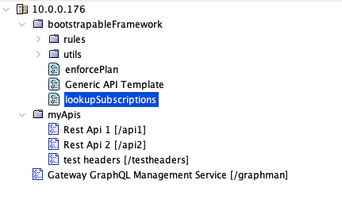
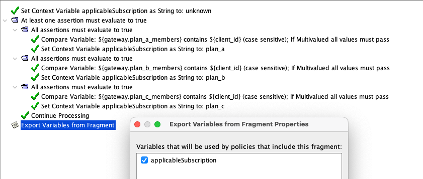
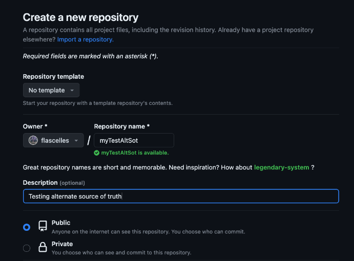

# Lab exercise 0

This lab will introduce you to graphman and its tooling for creating gateway configuration which will be deployed
in kubernetes as part of the following examples.

## Starting point

### Effective APIs

We have a development and a production gateway. They are divergent. You can see this divergence by calling the
same API on both environments as below.

Call API in dev:
```
curl https://mydevgw.brcmlabs.com/api1 -H "client-id: D63FA04C8447" -k
```

Call API in production

```
curl https://myprodgw.brcmlabs.com/api1 -H "client-id: D63FA04C8447" -k
```

> **_NOTE:_**  When sharing this workshop environment with multiple users, or reusing
an environment that has been used in a prior workshop, the difference between dev and prod
may not exist as it may have been reconciled ahead of time. The instructor can reset the
state of dev and prod by deleting the respective gw pods.

You should see different responses between dev and prod which is a reflection that the respective gateway configuration is divergent.

### Understanding how the example gateway configuration is structured

This example gateway organization is inspired by real-world customer setups that have been proven to scale.
The actual APIs are self-contained and can be used as-is but these are just examples, the configuration itself
is not meant to be used for your own project, but rather for understanding how to best manage your gateway
configuration.

#### Policy tree structure

The example Layer7 gateway configuration policy tree looks like this



APIs are located under the folder /myAPIs.
These APIs make use of policies that are packaged under the folder /bootstrapableFramework.
Graphman is another internal service deployed on the development gateway.

#### Non-policy config

In addition to APIs and policies, a Layer7 gateway contains other configuration entities. In this example, you will
find 'cluster-wide properties' (cwps), database connectors, broker connections, certificates, keys, and other secrets, etc.

#### Separation of concern and associated configuration packaging

For many customer organizations, APIs are added in a self-serve way by other business units. This layer of configuration
often has its own lifecycle which is different from the framework layer of configuration.

#### Managing SLA separately from the framework

An example of separation of concern that is used in this example is the memberships used to apply service level agreements.



As illustrated in the policy above, the membership to consumption tiers are managed in 3 CWPs:
- plan_a_members
- plan_b_members
- plan_c_members

To empower a business unit responsible for enforcing these SLAs, you could therefore separate out of the rest of the
framework configuration, the control of these 3 variables. As you will see in later examples, this will not require
any Layer7 specific expertise.

## Get graphman, point it at your environment

To get started with Graphman, get the client:

```
git clone https://github.com/Layer7-Community/graphman-client.git
```

Set the graphman home:

<details>
  <summary><b>Linux/MacOS</b></summary>

  ```
  export GRAPHMAN_HOME=~/your_graphman_path
  ```
</details>
<details>
  <summary><b>Windows</b></summary>

  ```
  set GRAPHMAN_HOME=%USERPROFILE%\your_graphman_path
  ```
</details>
<br/>

Point graphman to the development environment by editing graphman.configuration:

```
{
    "sourceGateway": {
        "address": "https://mydevgw.brcmlabs.com/graphman",
        "username": "admin",
        "password": "7layer",
        "rejectUnauthorized": false,
        "passphrase": "7layer"
    },
    "targetGateway": {
        "address": "https://myprodgw.brcmlabs.com/graphman",
        "username": "admin",
        "password": "7layer",
        "rejectUnauthorized": false,
        "passphrase": "7layer"
    }
}
```

## Pull configuration

Using the graphman client, you can pull configuration from the development environment.

### Pull all, and trim

Pulling the entire configuration from the gateway is all-encompassing and non discriminate. You will get more
configuration than you are interested in, but it is still a common starting point.
<details>
  <summary><b>Linux/MacOS</b></summary>

  ```
  $GRAPHMAN_HOME/graphman.sh export --using all --output totalDevEnv.json
  ```
</details>
<details>
  <summary><b>Windows</b></summary>

  ```
  %GRAPHMAN_HOME%\graphman.bat export --using all --output totalDevEnv.json
  ```
</details>
<br/>

Some of the configuration returned is local details which are managed locally at each target deployments. This includes
the main key for the gateway, the local administrator account, the listening ports which are set locally, etc. You can
'trim' unwanted configuration to boil it down to the area of interest.

In the following set of commands, we are taking the total configuration which we just extracted, then export it to 
a folder named base in an exploded form. Then we remove from the configuration the entities which are meant to be local.
And finally we re-implode the configuration into a new config bundle named trimmed.json.
<details>
  <summary><b>Linux/MacOS</b></summary>

```
$GRAPHMAN_HOME/graphman.sh explode --input totalDevEnv.json --output base
rm -rd base/listenPorts
rm -rd base/internalUsers
rm base/Gateway*webapi.json
rm base/keys/ssl.json
rm base/clusterProperties/cluster.hostname.json 
rm base/clusterProperties/keyStore.defaultSsl.alias.json
$GRAPHMAN_HOME/graphman.sh implode --input base --output trimmed.json
```
</details>
<details>
  <summary><b>Windows</b></summary>

```
%GRAPHMAN_HOME%\graphman.bat explode --input totalDevEnv.json --output base
rmdir /S/Q base\listenPorts
rmdir /S/Q base\internalUsers
del /Q base\Gateway*webapi.json
del /Q base\keys\ssl.json
del /Q base\clusterProperties\cluster.hostname.json 
del /Q base\clusterProperties\keyStore.defaultSsl.alias.json
%GRAPHMAN_HOME%\graphman.bat implode --input base --output trimmed.json

```
</details>
<br/>

### Pull by folder and dependencies

In the previous example, we used the 'all' query to pull the entire configuration. There are many types of queries
available out-of-box with the graphman client. Let's export configuration again, but instead of pulling the entire
configuration, let's pull only the framework configuration. To achieve this, we use the 'folder' query, and specify
a parameter for the folder path which in our case is '/boostrapableFramework'. The query is used with the 'full'
suffix. This tells graphman to pull not only the entities under that folder, but also other entities that are
dependencies for example, an object that does not show up in the folder structure but that a policy refers to, such as
a jdbc connection.

<details>
  <summary><b>Linux/MacOS</b></summary>

  ```
  $GRAPHMAN_HOME/graphman.sh export --using folder:full --variables.folderPath /bootstrapableFramework --output frameworkAndDeps.json
  ```
</details>
<details>
  <summary><b>Windows</b></summary>

  ```
  %GRAPHMAN_HOME%\graphman.bat export --using folder:full --variables.folderPath /bootstrapableFramework --output frameworkAndDeps.json
  ```
</details>
<br/>

### Using specialized queries

Graphman is a graphQL API and its client is packaged with preset queries. A power user can, however, craft their own
queries to tailor their specific re-usable need. To augment graphman with your own query, take a look at the folder
<details>
  <summary><b>Linux/MacOS</b></summary>

  ```
  $GRAPHMAN_HOME/queries
  ```
</details>
<details>
  <summary><b>Windows</b></summary>

  ```
  %GRAPHMAN_HOME%\queries
  ```
</details>
<br/>

An example custom query that you can use in this example is located under configAsCode. You can add it to your graphman
toolbox by copying it in the right folder:

<details>
  <summary><b>Linux/MacOS</b></summary>

  ```
  cp $GRAPHMAN_HOME/configAsCode/plansCWPs.* $GRAPHMAN_HOME/queries
  ```
</details>
<details>
  <summary><b>Windows</b></summary>

  ```
  copy %GRAPHMAN_HOME%\configAsCode\plansCWPs.* %GRAPHMAN_HOME%\queries
  ```
</details>
<br/>

You can now use this query which lets you extract the CWPs that control the SLA memberships:

<details>
  <summary><b>Linux/MacOS</b></summary>

  ```
  $GRAPHMAN_HOME/graphman.sh export --using plansCWPs --output memberships.json
  ```
</details>
<details>
  <summary><b>Windows</b></summary>

  ```
  %GRAPHMAN_HOME%\graphman.bat export --using plansCWPs --output memberships.json
  ```
</details>
<br/>

## Config bundle arithmetics

Bundles can be combined or subtracted from one another. In our scenario, we want to separate the membership control
our of the framework configuration bundle. Because we constructed the framework bundle by folder with dependencies
and that the CWPs that control the memberships are dependencies, they are automatically included. Using the diff
command, you can eliminate this overlap between the two bundles:

<details>
  <summary><b>Linux/MacOS</b></summary>

  ```
  $GRAPHMAN_HOME/graphman.sh diff --input frameworkAndDeps.json --input memberships.json --output frameworkWithoutMemberships.json
  ```
</details>
<details>
  <summary><b>Windows</b></summary>

  ```
  %GRAPHMAN_HOME%\graphman.bat diff --input frameworkAndDeps.json --input memberships.json --output frameworkWithoutMemberships.json
  ```
</details>
<br/>

Sometimes, you want to combine configuration from different sources into a single bundle. To do that, you can use the
combine command:

<details>
  <summary><b>Linux/MacOS</b></summary>

  ```
  $GRAPHMAN_HOME/graphman.sh combine --input frameworkWithoutMemberships.json --input memberships.json --output frameworkWithMembershipsAgain.json
  ```
</details>
<details>
  <summary><b>Windows</b></summary>

  ```
  %GRAPHMAN_HOME%\graphman.bat combine --input frameworkWithoutMemberships.json --input memberships.json --output frameworkWithMembershipsAgain.json
  ```
</details>
<br/>

## Apply configuration

> **_NOTE:_**  When sharing this workshop environment with multiple users, anybody can change the configuration of the production 
gateway, note that somebody might apply changes to production ahead of time and affect your ability to detect an
expected change between dev and prod.

There are many ways to leverage the configuration you captured in these exercises. For example, to bootstrap it on a gateway, just mount the json bundle in this folder:

```
/opt/SecureSpan/Gateway/node/default/etc/bootstrap/bundle
```

Although this would be an anti-pattern when working with ephemeral gateways, you can apply configuration to a live
gateway directly using the graphman import command. When using the import command, graphman will send the bundle to
the gateway set as the target in graphman.configuration. We already did this at the beginning so we are good to go:

<details>
  <summary><b>Linux/MacOS</b></summary>

  ```
  $GRAPHMAN_HOME/graphman.sh import --input frameworkWithoutMemberships.json
  ```
</details>
<details>
  <summary><b>Windows</b></summary>

  ```
  %GRAPHMAN_HOME%\graphman.bat import --input frameworkWithoutMemberships.json
  ```
</details>
<br/>

### View the result

To validate that you sucesfully applied configuration change from dev to prod, you can call the APIs in each of those
respective environments again and they should no longer produce divergent outputs.


Call API in dev:
```
curl https://mydevgw.brcmlabs.com/api1 -H "client-id: D63FA04C8447" -k
```

Call API in production

```
curl https://myprodgw.brcmlabs.com/api1 -H "client-id: D63FA04C8447" -k
```

They should now return the same 🤞

## Create Configuration Source of Truth

In a cloud-native deployment, you would not apply configuration directly using graphman.
Instead you would use graphman to create a configuration source-of-truth which would be applied in real-time by
the K8S operator.

Using your own git account, create a repo to hold the framework config.



Now, you can add your configuration to the git repo. See below the steps:

<details>
  <summary><b>Linux/MacOS</b></summary>

```
$GRAPHMAN_HOME/graphman.sh explode --input justMyFramework.json --output myTestAltSot
$GRAPHMAN_HOME/graphman.sh export --using summary --output myTestAltSot/sourceSummary.json
cd $GRAPHMAN_HOME/myTestAltSot
git init
git add .
git commit -m "first commit"
git branch -M main
git remote add origin git@github.com:<Owner>/<Repository>.git
git push -u origin main
```
</details>
<details>
  <summary><b>Windows</b></summary>

```
%GRAPHMAN_HOME%\graphman.bat explode --input justMyFramework.json --output myTestAltSot
%GRAPHMAN_HOME%\graphman.bat export --using summary --output myTestAltSot\sourceSummary.json
cd %GRAPHMAN_HOME%\myTestAltSot
git init
git add .
git commit -m "first commit"
git branch -M main
git remote add origin git@github.com:<Owner>/<Repository>.git
git push -u origin main
```
</details>
<br/>


