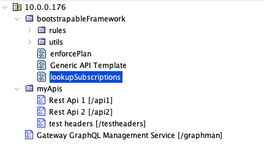
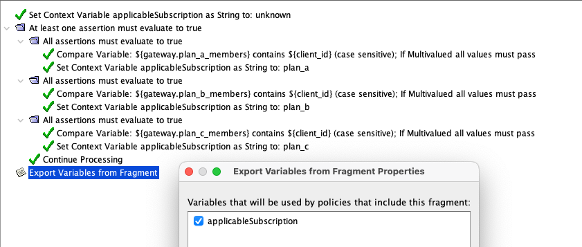
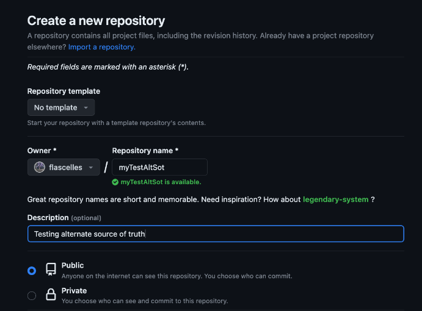

# Lab Exercise 1

This lab will introduce you to Graphman and its tooling for creating gateway configuration which will be deployed in Kubernetes as part of the following examples.

## 1. Comparing Environments

In this workshop, we have development and production gateways. At the beginning of the workshop, their configuration is divergent. You can see this divergence by calling the same API in both environments as below:

Call the API in development:
```
curl https://mydevgw.brcmlabs.com/api1 -H "client-id: D63FA04C8447" -k
```

Call the API in production
```
curl https://myprodgw.brcmlabs.com/api1 -H "client-id: D63FA04C8447" -k
```

> **_NOTE: When sharing this workshop environment with multiple users, or reusing an environment that has been used in a prior workshop, the difference between development and production may not exist as it may have been reconciled ahead of time. The instructor can reset the state of development and production by deleting the respective gateway pods._**

You should see different responses between development and production which is a reflection that the respective gateway configuration is divergent.

## 2. Understanding the Example Gateway Configuration

This example gateway organization is inspired by real-world customer setups that have been proven to scale. The actual APIs are self-contained and can be used as-is but these are just examples, the configuration itself is not meant to be used for your own project, but rather for understanding how to best manage your gateway configuration.

### Policy Tree Structure

The example gateway configuration policy tree looks like this:



APIs are located under the folder `/myApis`. These APIs make use of policies that are located under the folder `/bootstrapableFramework`.

Graphman (or the Gateway GraphQL Management Service) is another internal service deployed on the gateway with the URI `/graphman`.

### Other Configuration

In addition to APIs and policies, a gateway contains other configuration entities. In this example, you will find cluster-wide properties, database connections, broker connections, certificates, keys, secrets, etc.

### Separation of Concerns and Associated Configuration

For many customer organizations, APIs are added in a self-serve way by different business units. This layer of configuration often has its own lifecycle which is different from the framework layer of configuration.

As an example of separating concerns, the following policy demonstrates how cluster-wide properties can be used to track plan memberships with different SLAs:



As illustrated in the policy above, the membership to consumption tiers are managed in three cluster-wide properties:
- plan_a_members
- plan_b_members
- plan_c_members

You can empower a business unit responsible for enforcing these SLAs to manage these cluster-wide properties separately from the framework configuraiton. As you will see in later examples, this will not require any specific Layer7 expertise.

## 3. Configure the graphman-client

Set the GRAPHMAN_HOME environment variable:

> _**Note: This command will only set the environment variable in your current shell. You will need to repeat this command in new shells you open later, or use a more permanent option for setting environment variables in whatever operating system you are working with.**_

<details>
  <summary><b>Linux/MacOS</b></summary>

  ```
  export GRAPHMAN_HOME=/path/to/graphman-client
  ```
</details>
<details>
  <summary><b>Windows</b></summary>

  ```
  set GRAPHMAN_HOME=c:\path\to\graphman-client
  ```
</details>
<br/>

Point graphman to the development environment by editing `graphman.configuration` file:

```
{
    "sourceGateway": {
        "address": "https://mydevgw.brcmlabs.com/graphman",
        "username": "admin",
        "password": "7layer",
        "rejectUnauthorized": false,
        "passphrase": "7layer"
    },
    "targetGateway": {
        "address": "https://myprodgw.brcmlabs.com/graphman",
        "username": "admin",
        "password": "7layer",
        "rejectUnauthorized": false,
        "passphrase": "7layer"
    }
}
```

## 4. Export Configuration

Using graphman-client, you can export configuration from the development environment.

### Export all, and trim

Exporting the entire configuration from the gateway is all-encompassing and non-discriminate. You will get more configuration than you are interested in, but it is still a common starting point.
<details>
  <summary><b>Linux/MacOS</b></summary>

  ```
  $GRAPHMAN_HOME/graphman.sh export --using all --output totalDevEnv.json
  ```
</details>
<details>
  <summary><b>Windows</b></summary>

  ```
  %GRAPHMAN_HOME%\graphman.bat export --using all --output totalDevEnv.json
  ```
</details>
<br/>

Some of the configuration returned is local details which are managed locally at each target deployments. This includes the main key for the gateway, the local administrator account, the listening ports which are set locally, etc. You can "trim" unwanted configuration to boil it down to the area of interest.

In the following set of commands, we take the total configuration which we just extracted, and explode it to a folder named `base`. Then we remove the local configuration entities which we don't want, and implode the configuration into a new bundle named trimmed.json.
<details>
  <summary><b>Linux/MacOS</b></summary>

```
$GRAPHMAN_HOME/graphman.sh explode --input totalDevEnv.json --output base
rm -rd base/listenPorts
rm -rd base/internalUsers
rm base/Gateway*webapi.json
rm base/keys/ssl.json
rm base/clusterProperties/cluster.hostname.json 
rm base/clusterProperties/keyStore.defaultSsl.alias.json
$GRAPHMAN_HOME/graphman.sh implode --input base --output trimmed.json
```
</details>
<details>
  <summary><b>Windows</b></summary>

```
%GRAPHMAN_HOME%\graphman.bat explode --input totalDevEnv.json --output base
rmdir /S/Q base\listenPorts
rmdir /S/Q base\internalUsers
del /Q base\Gateway*webapi.json
del /Q base\keys\ssl.json
del /Q base\clusterProperties\cluster.hostname.json 
del /Q base\clusterProperties\keyStore.defaultSsl.alias.json
%GRAPHMAN_HOME%\graphman.bat implode --input base --output trimmed.json

```
</details>
<br/>

### Export by folder and dependencies

In the previous example, we used the `all` query to pull the entire configuration. There are many types of queries available out-of-box with graphman-client. Let's export configuration again, but instead of pulling the entire configuration, let's pull only the framework configuration. To achieve this, we use the `folder` query, and specify a parameter for the folder path which in our case is `/boostrapableFramework`. The query is used with the `:full` suffix to tell Graphman to export not only the entities under that folder, but also other entities that are dependencies. For example, an object that does not show up in the folder structure, but that a policy refers to like a JDBC connection.

<details>
  <summary><b>Linux/MacOS</b></summary>

  ```
  $GRAPHMAN_HOME/graphman.sh export --using folder:full --variables.folderPath /bootstrapableFramework --output frameworkAndDeps.json
  ```
</details>
<details>
  <summary><b>Windows</b></summary>

  ```
  %GRAPHMAN_HOME%\graphman.bat export --using folder:full --variables.folderPath /bootstrapableFramework --output frameworkAndDeps.json
  ```
</details>
<br/>

### Using specialized queries

Graphman is a graphQL API and its client is packaged with preset queries. A power user can, however, craft their own queries to tailor their specific re-usable need. To augment graphman with your own query, take a look at the queries folder:
<details>
  <summary><b>Linux/MacOS</b></summary>

  ```
  ls -al $GRAPHMAN_HOME/queries
  ```
</details>
<details>
  <summary><b>Windows</b></summary>

  ```
  dir %GRAPHMAN_HOME%\queries
  ```
</details>
<br/>

An example custom query that you can use in this example is located under configAsCode. You can add it to your graphman toolbox by copying it in the right folder:

<details>
  <summary><b>Linux/MacOS</b></summary>

  ```
  cp $GRAPHMAN_HOME/configAsCode/plansCWPs.* $GRAPHMAN_HOME/queries
  ```
</details>
<details>
  <summary><b>Windows</b></summary>

  ```
  copy %GRAPHMAN_HOME%\configAsCode\plansCWPs.* %GRAPHMAN_HOME%\queries
  ```
</details>
<br/>

You can now use this query which lets you extract the CWPs that control the SLA memberships:

<details>
  <summary><b>Linux/MacOS</b></summary>

  ```
  $GRAPHMAN_HOME/graphman.sh export --using plansCWPs --output memberships.json
  ```
</details>
<details>
  <summary><b>Windows</b></summary>

  ```
  %GRAPHMAN_HOME%\graphman.bat export --using plansCWPs --output memberships.json
  ```
</details>
<br/>

## 5. Config Bundle Arithmetics

Bundles can be combined or subtracted from one another. In our scenario, we want to separate the membership control from the framework configuration bundle. Because we constructed the framework bundle by folder with dependencies and the cluster-wide properties that control the memberships are dependencies, they are automatically included. Using the diff command, you can eliminate this overlap between the two bundles:

<details>
  <summary><b>Linux/MacOS</b></summary>

  ```
  $GRAPHMAN_HOME/graphman.sh diff --input frameworkAndDeps.json --input memberships.json --output frameworkWithoutMemberships.json
  ```
</details>
<details>
  <summary><b>Windows</b></summary>

  ```
  %GRAPHMAN_HOME%\graphman.bat diff --input frameworkAndDeps.json --input memberships.json --output frameworkWithoutMemberships.json
  ```
</details>
<br/>

Sometimes, you want to combine configuration from different sources into a single bundle. To do that, you can use the combine command:

<details>
  <summary><b>Linux/MacOS</b></summary>

  ```
  $GRAPHMAN_HOME/graphman.sh combine --input frameworkWithoutMemberships.json --input memberships.json --output frameworkWithMembershipsAgain.json
  ```
</details>
<details>
  <summary><b>Windows</b></summary>

  ```
  %GRAPHMAN_HOME%\graphman.bat combine --input frameworkWithoutMemberships.json --input memberships.json --output frameworkWithMembershipsAgain.json
  ```
</details>
<br/>

## 6. Apply Configuration

> **_NOTE: When sharing this workshop environment with multiple users, anybody can change the configuration of the production gateway. It's possible that somebody might apply changes to production ahead of time and affect your ability to detect an expected change between development and production._**

There are many ways to leverage the configuration you captured in these exercises. For example, to apply it statically on gateway startup, you can bootstrap it by mounting the JSON bundle in this folder:

```
/opt/SecureSpan/Gateway/node/default/etc/bootstrap/bundle
```

You can also apply it dynamically to a gateway with the import command without requiring a gateway restart. When using the import command, graphman will send the bundle to the gateway set as the target in graphman.configuration. We already did this at the beginning so we are good to go:

<details>
  <summary><b>Linux/MacOS</b></summary>

  ```
  $GRAPHMAN_HOME/graphman.sh import --input frameworkWithoutMemberships.json
  ```
</details>
<details>
  <summary><b>Windows</b></summary>

  ```
  %GRAPHMAN_HOME%\graphman.bat import --input frameworkWithoutMemberships.json
  ```
</details>
<br/>

## 7. View the result

To validate that you sucesfully applied configuration change from dev to prod, you can call the APIs in each of those respective environments again and they should no longer produce divergent outputs.


Call API in dev:
```
curl https://mydevgw.brcmlabs.com/api1 -H "client-id: D63FA04C8447" -k
```

Call API in production

```
curl https://myprodgw.brcmlabs.com/api1 -H "client-id: D63FA04C8447" -k
```

They should now return the same 🤞

## 8. Create a Configuration Source of Truth

In a cloud-native deployment, you would not apply configuration directly using Graphman. Instead, you would use Graphman to create a configuration source-of-truth which would be automatically applied statically or dynamically by the Layer7 Operator.

Using your own GitHub account, create a new repository to hold the framework configuration:



Now, you can add your configuration to the GitHub repository. See below the steps (making sure you update the commands as appropriate with your GitHub ID and repository name):

<details>
  <summary><b>Linux/MacOS</b></summary>

```
$GRAPHMAN_HOME/graphman.sh explode --input frameworkWithoutMemberships.json --output myTestAltSot
$GRAPHMAN_HOME/graphman.sh export --using summary --output myTestAltSot/sourceSummary.json
cd myTestAltSot
git init
git add .
git commit -m "first commit"
git branch -M main
```
Update and execute the following:
```
git remote add origin https://github.com/<Owner>/<Repository>.git
```
Finally:
```
git push -u origin main
```
</details>
<details>
  <summary><b>Windows</b></summary>

```
%GRAPHMAN_HOME%\graphman.bat explode --input frameworkWithoutMemberships.json --output myTestAltSot
%GRAPHMAN_HOME%\graphman.bat export --using summary --output myTestAltSot\sourceSummary.json
cd myTestAltSot
git init
git add .
git commit -m "first commit"
git branch -M main
```
Update and execute the following:
```
git remote add origin https://github.com/<Owner>/<Repository>.git
```
Finally:
```
git push -u origin main
```
</details>
<br/>