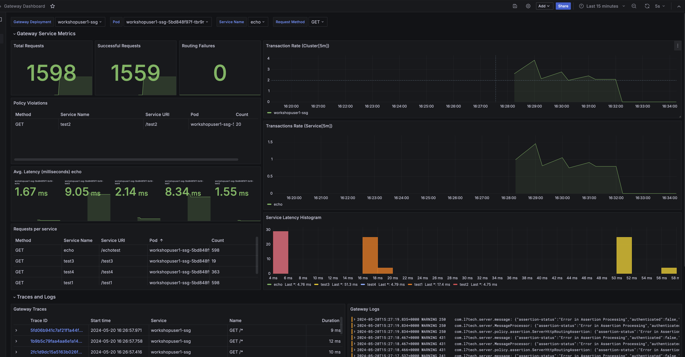

# Lab Exercise 6

1. [Prerequisites](#1-prerequisites)
1. [Overview](#2-overview)
1. [Create OpenTelemetry Collector Custom Resource](#3-create-opentelemetry-collector-custom-resource)
1. [Create OpenTelemetry Instrumentation Custom Resource](#4-create-opentelemetry-instrumentation-custom-resource)
1. [Deploy Test Services](#5-deploy-test-services)
1. [Configure the Gateway](#6-configure-the-gateway)
1. [Update the Gateway](#7-update-the-gateway)
1. [Call Test Services](#8-call-test-services)
1. [Monitor the Gateway](#9-monitor-the-gateway)

## 1. Prerequisites

Please make sure you've completed the steps [here](./readme.md) and have completed [Lab Exercise 5](./lab-exercise5.md) before beginning this exercise.

## 2. Overview

In this exercise you will [observe your Gateway using OpenTelemetry](https://techdocs.broadcom.com/us/en/ca-enterprise-software/layer7-api-management/api-gateway/11-1/install-configure-upgrade/configuring-opentelemetry-for-the-gateway.html). OpenTelemetry unifies metrics, logs, and tracing in a single framework by offering a standardized method to collect, process and export telemetry data for the Gateway. This standardization makes it easier to integrate with various libraries, frameworks, and tools, ensuring consistency for observability across different components of the Gateway. It also makes it easier to send telemetry to other [OpenTelemetry compatible vendor observability solutions](https://opentelemetry.io/ecosystem/vendors/) commonly used by Gateway customers. Being able to effectively employ observability is invaluable in the real-time troubleshooting of errors and maintaining optimal performance where and when it counts the most for the Gateway at runtime.

The Gateway includes the [OpenTelemetry SDK for Java](https://github.com/open-telemetry/opentelemetry-java) and requires that users deploy their own [OpenTelemetry Collector](https://opentelemetry.io/docs/collector/). With just the SDK, the Gateway can be configured to emit service metrics, custom metrics generated in policy using the Telemetry Metric assertion, service transaction traces and correlation IDs injected in service transaction log events. Users can optionally deploy an [OpenTelemetry Agent](https://opentelemetry.io/docs/languages/java/automatic/) with their Gateways to emit additional telemetry from additional [supported libraries, frameworks, application services, and JVMs](https://github.com/open-telemetry/opentelemetry-java-instrumentation/blob/main/docs/supported-libraries.md).

This lab exercise will focus on Gateway service metrics emitted using OpenTelemetry.

## 3. Create OpenTelemetry Collector Custom Resource

The [OpenTelemetry Operator](https://opentelemetry.io/docs/kubernetes/operator/) has already been deployed to the lab exercise's shared Kubernetes cluster. Just like the Layer7 Operator manages Gateway and Repository custom resources. The OpenTelemetry Operator manages OpenTelemetry Collector custom resources. This section will create an OpenTelemetry customer resource, and the OpenTelemetry Operator will correspondingly deploy an OpenTelemetry Collector as a sidecar to the Gateway pod. The OpenTelemetry Collector collects, filters and forwards metrics, traces and logs emitted by an OpenTelemetry Agent that will be injected into the Gateway and the OpenTelemetry SDK that is used by the Gateway.

Create the OpenTelemetry Collector custom resource:

<details>
  <summary><b>Linux/MacOS</b></summary>

  ```
  kubectl apply -f ./exercise6-resources/collector.yaml
  ```
</details>
<details>
  <summary><b>Windows</b></summary>

  ```
  kubectl apply -f exercise6-resources\collector.yaml
  ```
</details>
<br/>

## 4. Create OpenTelemetry Instrumentation Custom Resource

The OpenTelemetry Operator also manages [OpenTelemetry Instrumentation](https://github.com/open-telemetry/opentelemetry-operator?tab=readme-ov-file#opentelemetry-auto-instrumentation-injection) custom resources, and uses them to automatically instrument workloads, like the Gateway, by injecting OpenTelemetry Agents and related configuration.

View the OpenTelemetry Instrumentation custom resource file here, [`./exercise6-resources/instrumentation.yaml`](./exercise6-resources/instrumentation.yaml).

Create the OpenTelemetry Instrumentation custom resource:

<details>
  <summary><b>Linux/MacOS</b></summary>

  ```
  kubectl apply -f ./exercise6-resources/instrumentation.yaml
  ```
</details>
<details>
  <summary><b>Windows</b></summary>

  ```
  kubectl apply -f exercise6-resources\instrumentation.yaml
  ```
</details>
<br/>

## 5. Deploy Test Services

We will create a Kubernetes secret with a Graphman bundle that will bootstrap the following test services. These will be used to generate metrics and demonstrate other concepts during this workshop.

**Test Services**

- **/test1** - Always succeeds. Calls another service /echotest and returns result from it.
- **/test2** - Always generates a policy failure.
- **/test3** - Always generates a routing failure.
- **/test4** - Always succeeds. No routing.    
- **/test5** - Takes two query parameters as input and calculates age (years elapsed). It has an error that needs to be diagnosed and fixed.
  - **dob** - Date of Birth - Default format dd/MM/yyyy
  - **format** (optional) - Specify the format of dob
- **/echotest** - Returns system date and time.

Create the Graphman bundle secret:
<details>
  <summary><b>Linux/MacOS</b></summary>

  ```
  kubectl create secret generic graphman-otel-test-services  --from-file=./exercise6-resources/otel_test_services.json
  ```
</details>
<details>
  <summary><b>Windows</b></summary>

  ```
  kubectl create secret generic graphman-otel-test-services  --from-file=exercise6-resources\otel_test_services.json
  ```
</details>
<br/>

## 6. Configure the Gateway

We can now configure our Gateway custom resource for OpenTelemetry and the Graphman bundle secret.

Open the Gateway custom resource file here, [`./exercise6-resources/gateway.yaml`](./exercise6-resources/gateway.yaml).

First, configure your Gateway name. You will use this as a filter in Grafana later on.

Update `metadata.name` with your assigned workshop user number: 
```yaml
apiVersion: security.brcmlabs.com/v1
kind: Gateway
metadata:
  name: <workshopuser(n)-ssg>
...
```
For example:
```yaml
apiVersion: security.brcmlabs.com/v1
kind: Gateway
metadata:
  name: workshopuser99-ssg
...
```

Next, configure the Gateway via system properties to work with the OpenTelemetry Agent by _**uncommenting lines 127 - 132**_ (the Agent supports [these libraries and frameworks](https://opentelemetry.io/docs/languages/java/automatic/configuration/#suppressing-specific-agent-instrumentation) and the [bottom of this page](https://techdocs.broadcom.com/us/en/ca-enterprise-software/layer7-api-management/api-gateway/11-1/install-configure-upgrade/configuring-opentelemetry-for-the-gateway.html#_2bb6a0d5-80e0-43d9-a356-82d6f997cc64_config_agent) has an abridged list of those that are relevant to the Gateway).

```yaml
...
        # OpenTelemetry Agent Configuration
        otel.instrumentation.common.default-enabled=true
        otel.instrumentation.opentelemetry-api.enabled=true
        otel.instrumentation.runtime-metrics.enabled=true
        otel.instrumentation.runtime-telemetry.enabled=true
        otel.instrumentation.opentelemetry-instrumentation-annotations.enabled=true
        otel.java.global-autoconfigure.enabled=true
...
```

Next, add OpenTelemetry related cluster wide properties by _**uncommenting lines 97 - 111**_ .

```yaml
...
        - name: otel.enabled
          value: "true"
        - name: otel.serviceMetricEnabled
          value: "true"
        - name: otel.traceEnabled
          value: "true"
        - name: otel.metricPrefix
          value: l7_
        - name: otel.traceConfig
          value: |
            {
              "services": [
                {"resolutionPath": ".*"}
              ]
            }
...
```

Then, add the Graphman bundle by _**commenting out line 30 and uncommenting lines 31 - 34**_.

```yaml
...
    # bundle: []
    bundle:
    - type: graphman
      source: secret
      name: graphman-otel-test-services
...
```

Finally, add OpenTelemetry annotations by _**uncommenting lines 11 - 14**_.

```yaml
...
    podAnnotations:
      sidecar.opentelemetry.io/inject: "ssg"
      instrumentation.opentelemetry.io/inject-java: "true"
      instrumentation.opentelemetry.io/container-names: "gateway"
...
```

## 7. Update the Gateway

Now that we've configured our Gateway custom resource to make the Gateway more observable using OpenTelemetry, we can apply the updated manifest to Kuberenetes.

<details>
  <summary><b>Linux/MacOS</b></summary>

  ```
  kubectl apply -f ./exercise6-resources/gateway.yaml
  ```
</details>
<details>
  <summary><b>Windows</b></summary>

  ```
  kubectl apply -f exercise6-resources\gateway.yaml
  ```
</details>
<br/>

## 8. Call Test Services
We'll now create a configmap containing a script that will call our test services in a Kubernetes Job.

Update the GATEWAY_HOSTNAME _**on line 9**_ in [./exercise6-resources/api-request-configmap.yaml](./exercise6-resources/api-request-configmap.yaml) with your assigned workshop user number:

```yaml
...
    GATEWAY_HOSTNAME=workshopuser(n)-ssg
...
```
For example:
```yaml
...
    GATEWAY_HOSTNAME=workshopuser99-ssg
...
```

Create the configmap:
<details>
  <summary><b>Linux/MacOS</b></summary>

  ```
  kubectl apply -f ./exercise6-resources/api-request-configmap.yaml
  ```
</details>
<details>
  <summary><b>Windows</b></summary>

  ```
  kubectl apply -f exercise6-resources\api-request-configmap.yaml
  ```
</details>
<br/>

Create the job:
<details>
  <summary><b>Linux/MacOS</b></summary>

  ```
  kubectl apply -f ./exercise6-resources/test-services.yaml
  ```
</details>
<details>
  <summary><b>Windows</b></summary>

  ```
  kubectl apply -f exercise6-resources\test-services.yaml
  ```
</details>
<br/>

Watch the job run (making 1000 requests; with a 0 index):
```
kubectl logs -f job.batch/api-requests
```

## 9. Monitor the Gateway
1. Login into [Grafana](https://grafana.brcmlabs.com/) (using credentials found [here](https://github.com/CAAPIM/cloud-workshop-labs-environment/blob/main/cloud-workshop/environment.txt).
2. Click **Dashboards** on the left menu
3. Expand the Layer7 Folder
4. Click on **Gateway Dashboard**
5. Select your Gateway deployment (e.g. workshopuser99-ssg) from the **Gateway Deployment** dropdown field at the top of the page.

You will notice that there are more than 1000 requests, this is because the Gateway calls itself to simulate routing. Those calls are also captured by the OpenTelemetry integration.




# Start [Lab Exercise 7](./lab-exercise7.md)
