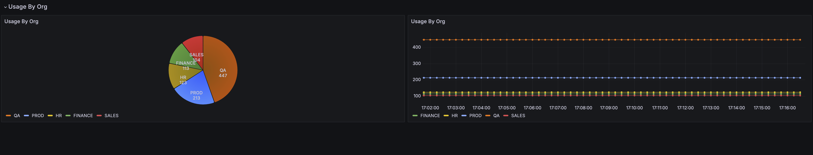

# Lab Exercise 7

1. [Prerequisites](#1-prerequisites)
2. [Overview](#2-overview)
3. [Message-Completed Global Policy Fragment](#3-message-completed-global-policy-fragment)
4. [Configure the Gateway](#4-configure-the-gateway)
5. [Update the Gateway](#5-update-the-gateway)
6. [Call Test Services](#6-call-test-services)
7. [Monitor the Gateway](#7-monitor-the-gateway)

## 1. Prerequisites

Please make sure you've completed the steps [here](./readme.md) and have completed [Lab Exercise 6](./lab-exercise6.md) before beginning this exercise.

## 2. Overview
This lab exercise will focus on Gateway custom metrics emitted using the [Telemetry Metric assertion](https://techdocs.broadcom.com/us/en/ca-enterprise-software/layer7-api-management/api-gateway/11-1/policy-assertions/assertion-palette/logging-auditing-and-alerts-assertions/opentelemetry-metric-assertion.html) in policy.

Each of the test services deployed during Lab Exercise 6 takes a query parameter which denotes the organization of the API consumer. We will use that parameter to monitor the usage of APIs by organization.

## 3. Message-Completed Global Policy Fragment
We will use the Telemetry Metric assertion in the message-completed global policy fragment to create a custom `usage_by_org` metric with org, service_name, serviceOid and serviceUrl attributes.

Create a secret containing the policy bundle:
<details>
  <summary><b>Linux/MacOS</b></summary>

  ```
  kubectl create secret generic graphman-otel-message-complete --from-file=./exercise7-resources/otel_message_complete.json
  ```
</details>
<details>
  <summary><b>Windows</b></summary>

  ```
  kubectl create secret generic graphman-otel-message-complete --from-file=exercise7-resources\otel_message_complete.json
  ```
</details>
<br/>

The policy and assertion will appear as follows:

<kbd></kbd>

## 4. Configure the Gateway
Continue using the Gateway custom resource file from Lab Exercise 6, [./exercise6-resources/gateway.yaml](./exercise6-resources/gateway.yaml)

Add the new bundle by _**uncommenting lines 35 - 37**_:
```yaml
...
    - type: graphman
      source: secret
      name: graphman-otel-message-complete
...
```

## 5. Update the Gateway
Apply the changes made to Gateway custom resource. The Layer7 Operator will then reconcile the changes.

_**Note: If you decided to use the gateway.yaml file that comes in the Lab Exercise 7 resources folder instead, then you will need to update your Gateway name like you did in Lab Exercise 6.**_

<details>
  <summary><b>Linux/MacOS</b></summary>

  ```
  kubectl apply -f ./exercise6-resources/gateway.yaml
  ```
</details>
<details>
  <summary><b>Windows</b></summary>

  ```
  kubectl apply -f exercise6-resources\gateway.yaml
  ```
</details>
<br/>

Check the status of the Gateway (ssg) pod:
```
kubectl get pods
```

And wait until 2/2 containers are READY in the ssg pod. For example:
```
NAME                                                  READY   STATUS      RESTARTS       AGE
api-requests-5bvx2                                    0/1     Completed   0              5m38s
layer7-operator-controller-manager-7c996ccfb6-9qsw6   2/2     Running     1 (108m ago)   109m
ssg-56ff97b54d-nsx86                                  2/2     Running     0              116s
```

## 6. Call Test Services
We will reuse the job created in Lab Exercise 6 to generate some load and emit our new metric.

First, delete the job that was created in Lab Exercise 6:
```
kubectl delete job api-requests
```

Then, create the job again:
<details>
  <summary><b>Linux/MacOS</b></summary>

  ```
  kubectl apply -f ./exercise6-resources/test-services.yaml
  ```
</details>
<details>
  <summary><b>Windows</b></summary>

  ```
  kubectl apply -f exercise6-resources\test-services.yaml
  ```
</details>
<br/>

Watch the job run (making 1000 requests; with a 0 index):
```
kubectl logs -f job.batch/api-requests
```

## 7. Monitor the Gateway
1. Login into [Grafana](https://grafana.brcmlabs.com/) (using credentials found [here](https://github.com/CAAPIM/cloud-workshop-labs-environment/blob/main/cloud-workshop/environment.txt).
2. Click **Dashboards** on the left menu
3. Expand the Layer7 Folder
4. Click on **Gateway Dashboard**
5. Select your Gateway deployment (e.g. workshopuser99-ssg) from the **Gateway Deployment** dropdown field at the top of the page.
6. Scroll down to the bottom of the dashboard to see **Usage by Org**




# Start [Lab Exercise 8](./lab-exercise8.md)
