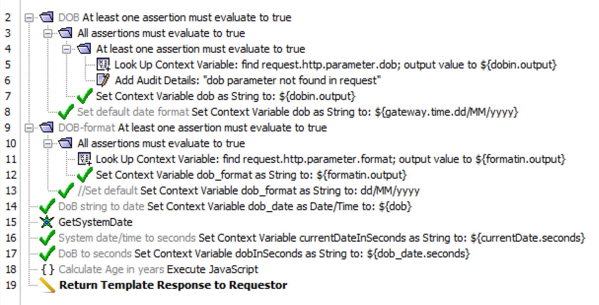
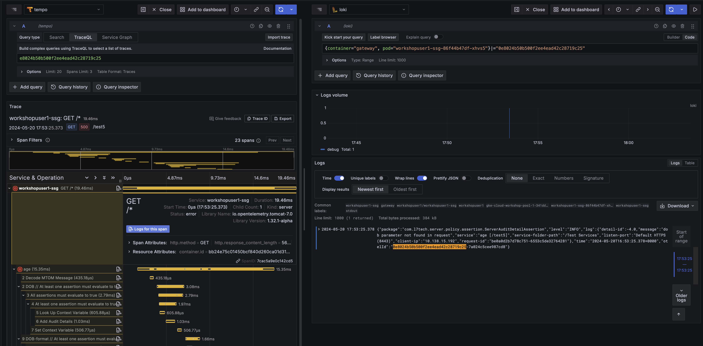

# Lab Exercise 8

1. [Prerequisites](#1-prerequisites)
2. [Overview](#2-overview)
3. [Enable Tracing on the Gateway](#3-enable-tracing-on-the-gateway)
1. [Call Test Service](#5-call-test-service)
1. [View Trace in Grafana](#6-view-trace-in-grafana)

## 1. Prerequisites

Please make sure you've completed the steps [here](./readme.md) and have completed [Lab Exercise 7](./lab-exercise7.md) before beginning this exercise.

## 2. Overview

This lab exercise will focus on Gateway service transaction traces emitted using OpenTelemetry. We will use traces to diagnose an error in on of the previously deployed test service's policy.

## 3. Enable Tracing on the Gateway

To be practically useful, we need to be able to selectively enable and filter tracing to have a controlled impact on Gateway and OpenTelemetry backend processing and storage resource utilization.

The `otel.traceEnabled` cluster-wide property can be used to enable and disable tracing.

The `otel.traceConfig` cluster-wide property can be used to control which services, assertions and context variables will be traced. It can also filter tracing to requests sent from a specific client IP address or accompanied by a specific query parameter. For examples, go [here](https://techdocs.broadcom.com/us/en/ca-enterprise-software/layer7-api-management/api-gateway/11-1/install-configure-upgrade/configuring-opentelemetry-for-the-gateway/sampling-and-filtering-for-opentelemetry.html#_453eefc6-b883-4185-b10e-d11a94fd0c3c).

Continue using the Gateway custom resource file from Lab Exercise 6, [`./exercise6-resources/gateway.yaml`](./exercise6-resources/gateway.yaml).


You'll notice that when we updated this Gateway we uncommented the following cluster-wide properties, you will have also noticed traces in the Grafana Dashboard:

```yaml
...
- name: otel.traceEnabled
  value: "true"
- name: otel.traceConfig
  value: |
    {
      "services": [
        {"resolutionPath": ".*"}
      ]
    }
...
```

## 4. Call Test Service

We will call this test service to generate a trace (this request is also part of our test bundle from earlier so you should already have traces present in Grafana):

- **/test5** - Takes two query parameters as input and calculates age (years elapsed). It has an error that needs to be diagnosed and fixed.
  - **dob** - Date of Birth - Default format dd/MM/yyyy
  - **format** (optional) - Specify the format of dob

<kbd></kbd>

First, find the external IP address for the Gateway service in your namespace:

```
kubectl get svc
```

Here is an example of the previous command's output. In this example, the external IP address is **35.185.239.250**. Yours will be different.

```
NAME                                 TYPE           CLUSTER-IP     EXTERNAL-IP      PORT(S)                         AGE
controller-manager-metrics-service   ClusterIP      10.96.11.69    <none>           8443/TCP                        54d
ssg-collector                        ClusterIP      10.96.2.217    <none>           4317/TCP,4318/TCP               159m
ssg-collector-headless               ClusterIP      None           <none>           4317/TCP,4318/TCP               159m
ssg-collector-monitoring             ClusterIP      10.96.12.233   <none>           8888/TCP                        159m
workshopuser2-ssg                    LoadBalancer   10.96.8.127    35.185.239.250   8443:30929/TCP,9443:30052/TCP   154m
```

Next, call the test service on the Gateway using your external IP address several times. _**Note: The OpenTelemetry instrumentation configured for these exercises is using a sampling rate of 0.25 per parent ID. That means the Collector will process 1 of every 4 traces to the backend.**_

For example:

```
curl -k "https://<your-external-ip>:8443/test5?dob=01/01/1971"
```

The API should respond like so:
```xml
<?xml version="1.0" encoding="UTF-8"?>
<soapenv:Envelope xmlns:soapenv="http://schemas.xmlsoap.org/soap/envelope/">
    <soapenv:Body>
        <soapenv:Fault>
            <faultcode>soapenv:Server</faultcode>
            <faultstring>Policy Falsified</faultstring>
            <faultactor>https://localhost:8443/test5</faultactor>
            <detail>
                <l7:policyResult status="Error in Assertion Processing" xmlns:l7="http://www.layer7tech.com/ws/policy/fault"/>
            </detail>
        </soapenv:Fault>
    </soapenv:Body>
</soapenv:Envelope>
```

## 6. View Trace in Grafana
1. Login into [Grafana](https://grafana.brcmlabs.com/) (using credentials found [here](https://github.com/CAAPIM/cloud-workshop-labs-environment/blob/main/cloud-workshop/environment.txt).
2. Click **Dashboards** on the left menu
3. Expand the Layer7 Folder
4. Click on **Gateway Dashboard**
5. Select your gateway deployment (e.g. workshopuser99-ssg) from the **Gateway Deployment** dropdown field at the top of the page.
6. Select the Age Service
6. Scroll down to Traces and Logs panel
7. Click on one of the Traces (this will open a new tab)
8. Click on **Logs for this span** (this will open the span specific Gateway logs on the right)

_**Note: Correlating logs to traces and spans is possible, because when tracing is enabled on the gateway, the gateway will inject trace and span IDs into service transaction event logs.**_



# Start [Lab Exercise 9](./lab-exercise9.md)
