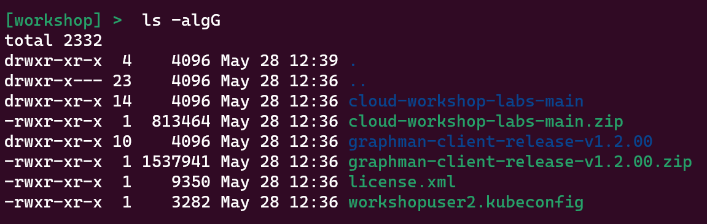

# Layer7 Cloud Workshop

> _**Important: Use a browser to view this lab content during the workshop. Do not try to use the raw markdown content directly during the workshop.**_

1. [Overview](#1-overview)
1. [Prerequisites](#2-prerequisites)
1. [Share GitHub ID](#3-share-github-id)
1. [Download Temporary License](#4-download-temporary-license)
1. [Download Kubeconfig](#5-download-kubeconfig)
1. [Prepare Folder](#6-prepare-folder)
1. [Connect to Kubernetes](#7-connect-to-kubernetes)
1. [Lab Exercises](#8-lab-exercises)

## 1. Overview
This repository provides step by step instructions and supporting artifacts for a number of Layer7 Cloud Workshop lab exercises. The lab exercises introduce participants to Graphman, the Layer7 Operator, Open Telemetry and external secret management using the Layer7 Operator.


## 2. Prerequisites
These prerequisites are required for completing the lab exercises in the Layer7 Cloud Workshop. They should be downloaded, installed and/or otherwise accessible during the workshop.

- Shared Kubernetes cluster prepared specifically for this workshop
- Experience operating in a Linux/Mac/Windows terminal
- This repository
- [GitHub Account](https://github.com/signup)
- [git](https://git-scm.com/book/en/v2/Getting-Started-Installing-Git) or [GitHub Desktop](https://docs.github.com/en/desktop/installing-and-authenticating-to-github-desktop/installing-github-desktop)
- [kubectl (v1.27+)](https://kubernetes.io/docs/tasks/tools/)
- [Node.js (v16+)](https://nodejs.org/en/download)
- graphman-client ([v1.0.01](https://github.com/Layer7-Community/graphman-client/tree/release/v1.0.01) if using the pre-11.1 gateway combined image; [v1.1.0](https://github.com/Layer7-Community/graphman-client/tree/release/v1.1.00) if using a 11.1+ gateway image)
- [Temurin OpenJDK 11](https://adoptium.net/temurin/releases/?version=11) (for Mac users; 11 or later depending on version of Layer7 Policy Manager deployed at the time of the workshop)
- [Layer7 Policy Manager 11.0 CR1](https://support.broadcom.com/group/ecx/productfiles?sellable=APIENT990&release=11.0&os=MULTI-PLATFORM&servicePk=0000&language=EN) (or later depending on actual gateway version deployed at the time of the workshop)

## 3. Share GitHub ID
A private GitHub repository is used for sharing a temporary license and environment related information required by this workshop. You must share your GitHub ID with the workshop coordinator to be given access to the private repository.

## 4. Download Temporary License
A temporary license has been provided for this workshop. Download the [license](https://github.com/CAAPIM/cloud-workshop-labs-environment/blob/main/cloud-workshop/license.xml) from the private repository.

## 5. Download Kubeconfig
For this workshop, you will be assigned a user number and a corresponding namespace in a shared Kubernetes cluster. Download the [kubeconfig file for your user number](https://github.com/CAAPIM/cloud-workshop-labs-environment/tree/main/cloud-workshop/attendees) (e.g. `workshopuser(n).kubeconfig`) from the private repository.

## 6. Prepare Folder
Much of the work in these labs will be done at the command line in a terminal. It will be easier if you prepare a folder (e.g. `workshop`) inside of which you will copy many of the prerequisites and do much of the work. When done, your folder should look something like this:



## 7. Connect to Kubernetes
Update and execute the following command with the path to your kubeconfig file, and test your connection to the Kubernetes cluster:

<details>
  <summary>Linux/MacOS</summary>

  ```
  kubectl get all --kubeconfig /path/to/workshopuser(n).kubeconfig
  ```

  Expected response at the beginning of the workshop:
  ```
  No resources found in workshopuser(n) namespace.
  ```
</details>
<details>
  <summary>Windows</summary>

  ```
  kubectl get all --kubeconfig c:\path\to\workshopuser(n).kubeconfig
  ```

  Expected response at the beginning of the workshop:
  ```
  No resources found in workshopuser(n) namespace.
  ```
</details>
<br/>

To avoid providing the `--kubeconfig` argument with every `kubectl` command, update and execute the following command with the path to your kubeconfig file to set the KUBECONFIG environment variable in your current shell.

> _**Note: This command will only set the environment variable in your current shell. You will need to repeat this command in new shells you open later, or use a more permanent option for setting environment variables in whatever operating system you are working with.**_

> _**Note: Make sure you provide the absolute path to the kubeconfig file. If you provide a relative path, then `kubectl` will not find it after changing directories from the directory the provided path is relative to.**_

<details>
  <summary>Linux/MacOS</summary>

  ```
  export KUBECONFIG=/absolute/path/to/workshopuser(n).kubeconfig
  ```
</details>
<details>
  <summary>Windows</summary>

  ```    
  set KUBECONFIG=c:\absolute\path\to\workshopuser(n).kubeconfig
  ```
</details>
<br/>

Test your configuration again:
```
kubectl get all
```
Expected response at the beginning of the workshop:
```
No resources found in workshopuser(n) namespace.
```

## 8. Lab Exercises
- [Exercise 1](./lab-exercise1.md)
  - This exercise explores configuration as code concepts using Graphman.
- [Exercise 2](./lab-exercise2.md)
  - This exercise should familiarize you with the basic concepts of the Layer7 Operator.
- [Exercise 3](./lab-exercise3.md)
  - This exercise introduces initContainers and bundles (restman/graphman).
- [Exercise 4](./lab-exercise4.md)
  - This exercise introduces the repository custom resource.
- [Exercise 5](./lab-exercise5.md)
  - This exercise combines the previous examples in more depth.
- [Exercise 6](./lab-exercise6.md)
  - This exercise enables Open Telemetry and Service Metrics on Gateway.
- [Exercise 7](./lab-exercise7.md)
  - This exercise introduces custom Gateway Telemetry assertion.
- [Exercise 8](./lab-exercise8.md)
  - This exercise will will trace a Gateway Service using Trace Open Telemetry tracing.
- [Exercise 9](./lab-exercise9.md)
  - This exercise introduces External Secrets.

# Start [Lab Exercise 1](./lab-exercise1.md)
